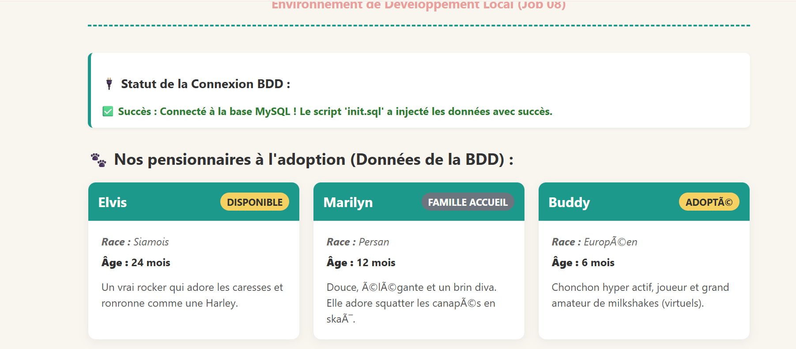
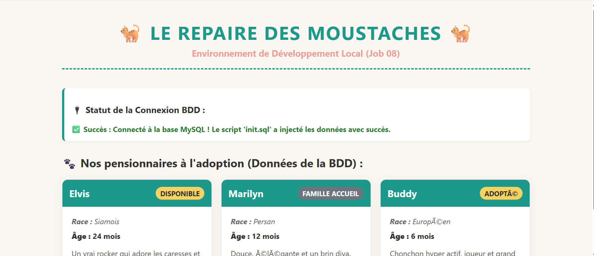

Markdown
# Job 08 - Stack Fullstack "Le Repaire des Moustaches"

Cette stack Docker Compose configure l'environnement complet de l'application avec initialisation automatisée de la base de données.

## 🚀 Lancement rapide

1. Copiez le fichier d'exemple pour créer votre environnement local :
   ```bash
   cp .env.example .env
(Note : Remplissez les variables dans le fichier .env si nécessaire)

Démarrez l'infrastructure :

Bash
docker compose up -d
🌐 Accès locaux
Le site web PHP : http://localhost:8080

phpMyAdmin : http://localhost:8081


