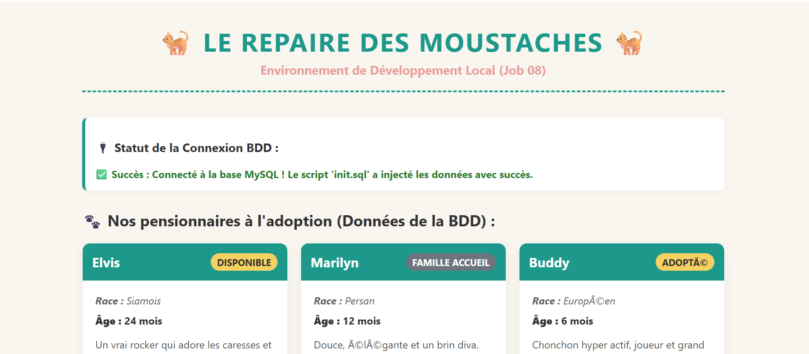

Markdown
# 🐈 Le Repaire des Moustaches - Stack Docker Avancée (Job 09)

Ce dépôt contient l'infrastructure Docker complète et finalisée pour le projet **Le Repaire des Moustaches**. Conçue sur mesure via un `Dockerfile` personnalisé, cette stack respecte les standards professionnels de déploiement local.

---

## 🛠️ Spécifications Techniques de l'Infrastructure

La stack est découpée en 3 conteneurs distincts et isolés :
- **`repaire-app-container`** : Serveur Web Apache avec **PHP 8.2**, module `mod_rewrite` activé pour la gestion des routes, et drivers de base de données (`pdo`, `pdo_mysql`, `mysqli`) compilés à la volée.
- **`repaire-db-container`** : Serveur **MySQL 8** sécurisé, équipé d'un système de vérification d'état (`healthcheck`) et d'un volume persistant pour les données.
- **`repaire-pma-container`** : Interface **phpMyAdmin** connectée de manière transparente au serveur de base de données pour l'administration visuelle.

---

## 🚀 Guide de Lancement Rapide

### 1. Préparation de l'environnement
Dupliquez le fichier d'exemple pour initialiser vos variables d'environnement locales :
```bash
cp .env.example .env
(Les variables pré-configurées permettent d'éviter les conflits de ports et de sécuriser les accès à la base de données).

2. Construction et démarrage de la stack
Pour compiler l'image personnalisée via le Dockerfile et lancer les services en arrière-plan :

Bash
docker compose up -d --build
💡 Initialisation Automatique : Au tout premier démarrage, le script situé dans ./config/init.sql est automatiquement exécuté par MySQL pour créer la base de données, la structure des tables (users, cats), et injecter un jeu de données de test (Elvis, Marilyn, Buddy).

🌐 Points d'Accès Locaux
Une fois la stack démarrée, les services sont accessibles aux adresses suivantes :

Application Web (PHP) : http://localhost:8080

Administration BDD (phpMyAdmin) : http://localhost:8081

🛑 Commandes de Maintenance
Pour arrêter la stack (sans perte de données) :

Bash
docker compose down
Pour réinitialiser complètement l'environnement (purge du volume et ré-injection du SQL) :

Bash
docker compose down -v

