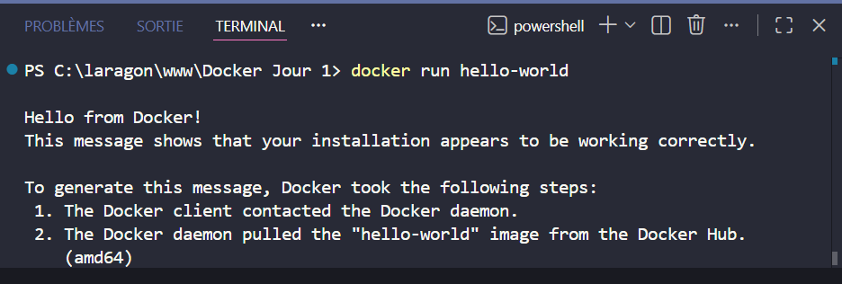

# 🚀 Job 01 : Mon premier conteneur

Voici la preuve du lancement réussi de mon tout premier conteneur avec la commande `docker run hello-world`. Le daemon Docker a bien téléchargé l'image depuis la registry officielle et l'a exécutée.

